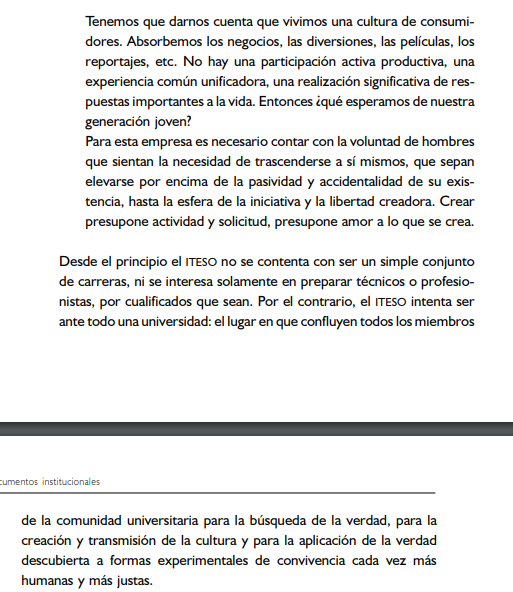
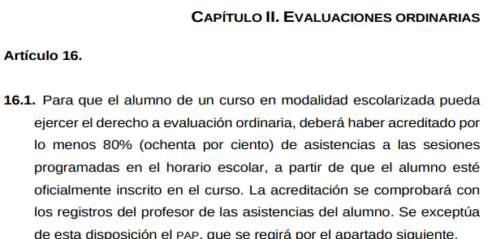

# Actitud, motivación y evaluación

## Aprender para trascender

Normalmente, los estudiantes se preguntan *¿para qué me sirve esto?*, especialmente si una materia es demandante. Al respecto, mi postura acerca de la educación es la misma que la expresada en las **Orientaciones fundamentales del ITESO**:

  

En específico

> ... el `ITESO` no se contenta con ser un simple conjunto de carreras, ni se interesa solamente en preparar técnicos o profesionales, por cualificados que sean. Por el contrario, el `ITESO` intenta ser ante todo una universidad

Por lo tanto, mi tarea principal como profesor es formar *universitarios*, más que técnicos. No obstante, en este curso se procurará mantener un saludable balance entre las generalidades teóricas más abstractas y ejemplos prácticos, teniendo en cuenta que entre más concreto y específico es un ejemplo, es menos general y, en ese sentido, su rango de aplicación reducido.

---

## Evaluación

- De acuerdo con el [`Reglamento de evaluación para alumnos de licenciatura de ITESO`](https://www.iteso.mx/documents/2624322/0/Reglamento+de+evaluaciones+acad%C3%A9micas+para+los+estudiantes+de+licenciatura.pdf/faf8a50e-4411-4f8c-adfd-6097ef8f3881), deben acreditar por lo menos el 80 % de asistencia.

  

- El curso estará compuesto de 4 unidades, y un examen por unidad. Consultar la Guía (siguiente apartado) y en CANVAS para más información sobre el programa.
  - Cada examen tendrá un valor de 15 puntos (4x15 = 60).
  - Las tareas se dividirán en a y b. Las tareas a son resolución de ejercicios, y las tareas b son una investigación de aplicación. La suma de ambas dará un total de 10 puntos (4 x 10 = 40).
  - La suma de ambos dará el total de 100.
- Respuestas a exámenes o tareas *excepcionales* podrán ser acreedores a puntos extras hasta por un 0.05 de la calificación (que se puede usar en cualquier tarea o examen en la que les haya ido mal).

---